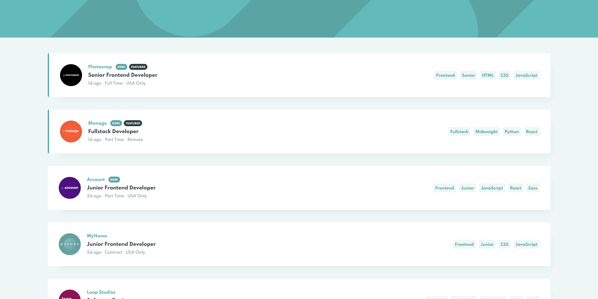

# Frontend Mentor - Job listings with filtering solution

This is a solution to the [Job listings with filtering challenge on Frontend Mentor](https://www.frontendmentor.io/challenges/job-listings-with-filtering-ivstIPCt). Frontend Mentor challenges help you improve your coding skills by building realistic projects.

## Table of contents

- [Overview](#overview)
  - [The challenge](#the-challenge)
  - [Screenshot](#screenshot)
  - [Links](#links)
- [My process](#my-process)
  - [Built with](#built-with)

## Overview

### The challenge

Users should be able to:

- View the optimal layout for the site depending on their device's screen size
- See hover states for all interactive elements on the page
- Filter job listings based on the categories

### Screenshot

### Links

- [Solution URL](https://www.frontendmentor.io/solutions/responsive-app-using-vuejs-and-bem-notation-Dy1CcQc4x)
- [Live site URL](https://vilmarmjr.github.io/frontend-mentor-job-listing)

## My process

### Built with

- [TypeScript](https://www.typescriptlang.org/)
- [Vue.js](https://vuejs.org/)
- [BEM Notation](http://getbem.com/)
- Mobile-first workflow
